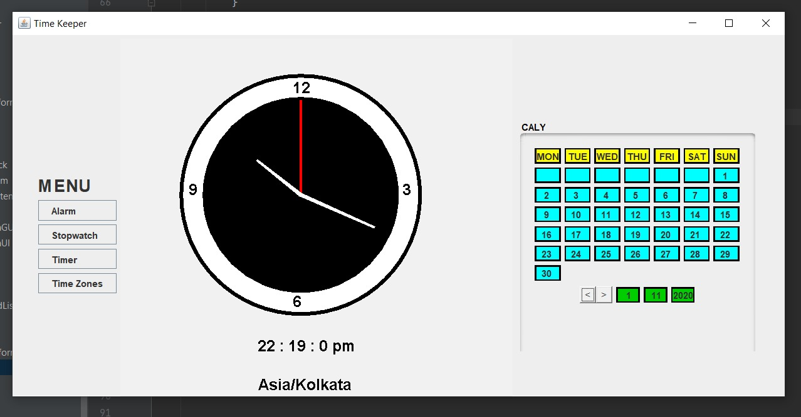
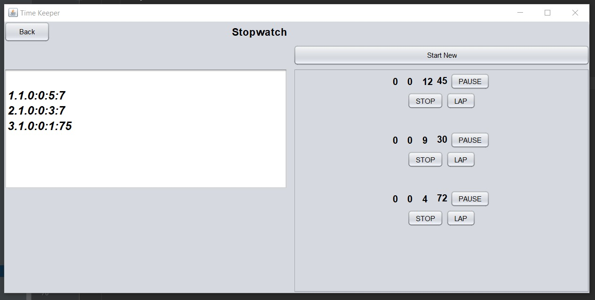

#  TIME KEEPER

We have a lot of responsibilities on our shoulders, academics college events as well as extra activites.
It becomes very difficult for us to manage our time.
We lose track of time and we sometimes, miss some important work that was to be done.
So we can distribute time for all our work. We just need a timekeeper.
So, here we created an application having following features and functionalities.

# HOW TO USE
Install Intellij  
Run main function at the Menu.java page 
Enjoy our App Functionalitites :) 

# Features:
1.Clock : display current date, day and time.(Analog + digital) 
2.Stopwatch : start, pause, resume, lap functionalities.(Multiple Stopwatch) 
3.Alarm : time based event triggering, snooze option. (diffrent tone for different alarm) 
4.Timer : set time and it runs backward, start, pause, resume, stop functionalities.(Multiple Timers) 
5.Calendar : display of all months (with navigation) 
6. Time Zones : add and display clocks for different time zones 
**State will be saved even after program restarts.**
# Glimpse Of our Project

  

  

